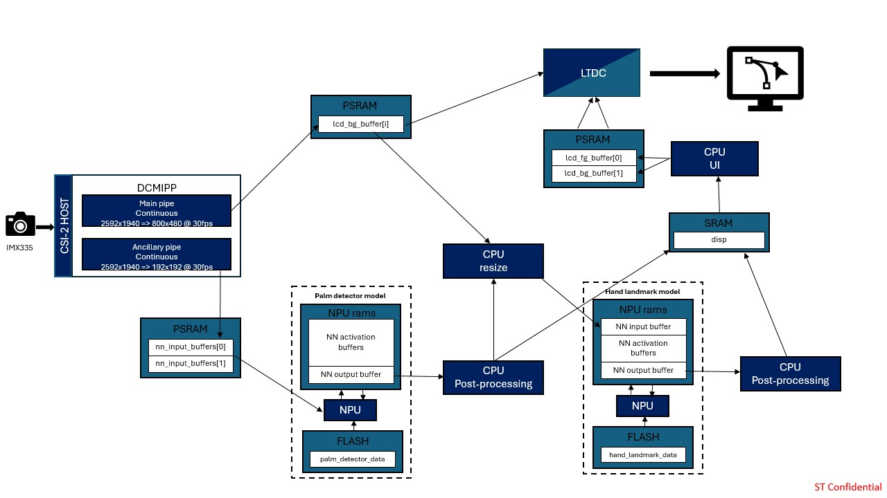
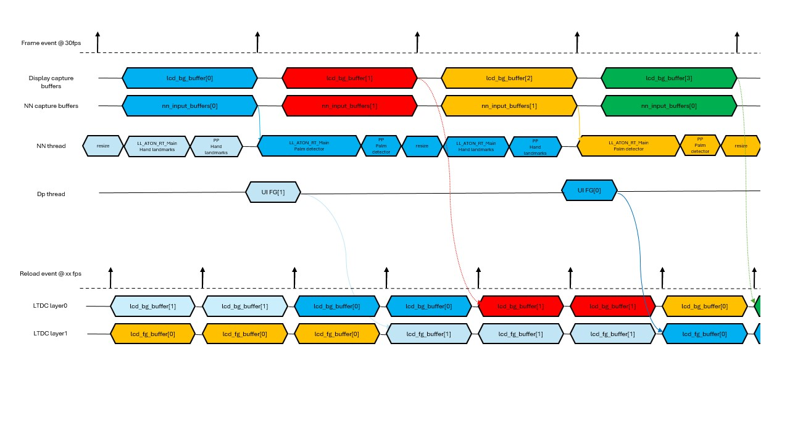

# Application Overview

### Application Data Flow

### Application Timing Diagram

## Memory Footprint Details

### Read-Only Data

| Name                 | Size    | Location | Notes          |
|----------------------|---------|----------|----------------|
| `palm_detector_data` | 1.14 MB | .rodata  | FLASH xSPI2 8b |
| `hand_landmark_data` | 3.21 MB | .rodata  | FLASH xSPI2 8b |

### Read-Write Data

| Name                     | Size    | Location     | Notes                              |
|--------------------------|---------|--------------|------------------------------------|
| `lcd_bg_buffer`          | 4608 KB | .psram_bss   | PSRAM / (800x480x3) x 4 / RGB888   |
| `lcd_fg_buffer`          | 1500 KB | .psram_bss   | PSRAM / (800x480x2) x 2 / ARGB4444 |
| `nn_input_buffers`       | 221 KB  | .psram_bss   | PSRAM / (192x192x3) x 2 / RGB888   |
| `activations`            | 1152 KB | 0x34200000   | NPURAMS                            |
| `threads stacks`         | 16 KB   | .bss         | SRAM / 4096 * 4                    |

## DCMIPP and ISP

### DCMIPP Overview

- Pipe 1 is enabled using `CMW_CAMERA_Start(DCMIPP_PIPE1, *ptr_dst, CAMERA_MODE_CONTINUOUS);` to continuously transmit images from IMX335 to the DISPLAY_BUFFER_NB buffered `lcd_bg_buffer[]`. Note that `ptr_dst` will be updated at the pipe1 frame_event.
- Pipe 2 is enabled using `CMW_CAMERA_Start(DCMIPP_PIPE2, *ptr_dst, CAMERA_MODE_CONTINUOUS);` to continuously transmit images from IMX335 to the double buffered `nn_input_buffers[]`. Note that `ptr_dst` will be updated at the pipe2 frame_event. This allows dropping the previous frame if the buffer is still in use by the nn thread.
- For each capture, the ISP configuration is updated to enhance the image quality depending on the illumination conditions. It is initialized through `ISP_Init` and then executed with `ISP_BackgroundProcess`.

For more details on DCMIPP, see the Digital Camera Interface Pixel Pipeline (DCMIPP) section in the STM32N6 Reference Manual.
